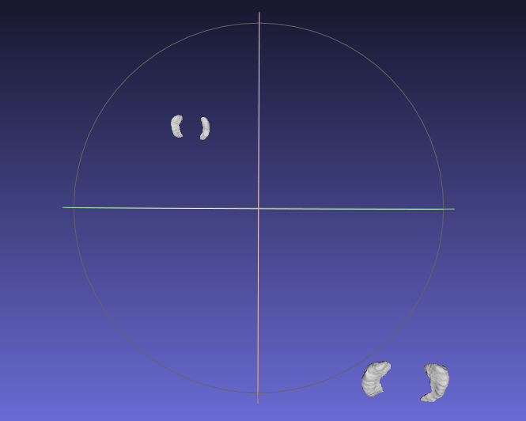
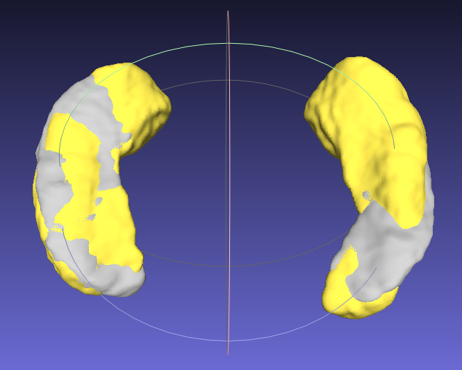
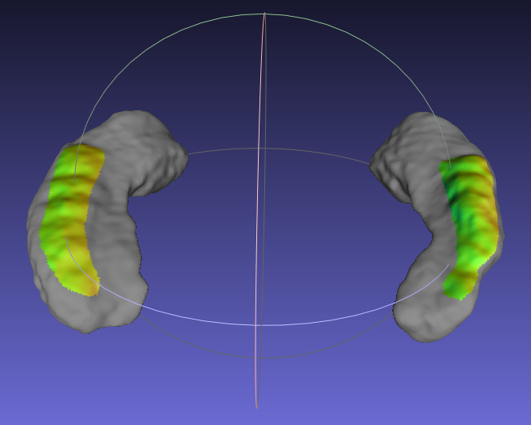

# Fine hippocampal morphology analysis with a multi-dataset cross-sectional study on 2911 subjects
This repository contains the process code of registration and mesh conversion.


## Getting Started
* Operating system: Ubuntu-22.04.1
* Software: 3D Slicer (https://www.slicer.org/)

If just for testing, just run the files in the order of the numbers contained inside their names. If interested, just change the file paths as you like.

## Mesh conversion
1. Install 3D Slicer software and go to the software directory `/home/xxx/Downloads/Slicer-5.2.2-linux-amd64`, open the terminal;
2. Replace the output dir path and the suffix of the input segmentation files
3. Run the following code in terminal:
```
Slicer --python-script path_to_1_genVTKFromBinary.py --no-splash --testing
``` 
* If you want to keep the operation window present for check, remove the parameter `--testing`
* For more information, please refer to: https://slicer.readthedocs.io/en/latest/


## Registration
1. Please change the `sr_ply_dir`, `registrated_ply_dir` and `target_pd_path` to your own path first. And then run the `2_main_registration.py`.
2. If run the code `5_l-r_for_fine-tune.py` for fine tuning, it's suggested to run the previous steps before it.

## Use KDTree to find the point
This may take a few minutes, just wait for it. If testing, downsampling is recommended.

### Show results
Two mesh results before and after registration are shown. The yellow one is the moving mesh.

<!-- |  |  | -->
<figure>



</figure>


## Acknowledgement
The code is mostly based on the 3D Slicer, open3d, probreg and trimesh software. Thanks for their contribution.
